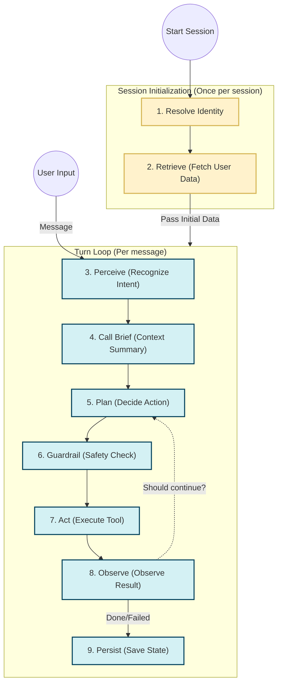

# Telesale Agent Architecture

## 1. Processing Flow & System Architecture

The Telesale Agent follows a two-phase architecture. The **Session Initialization** phase runs once when a user session starts to load their profile. The **Turn Loop** runs for each message the user sends.



### 1. Resolve Identity
Returns `CustomerIdentity`. A production resolver can match an incoming phone number, chat account, email, or customer code against CRM data. An already confirmed identity can be retained across turns.

### 2. Retrieve
Returns `RetrievedContext` containing relevant customer history, long-term memory, knowledge documents, and currently active promotions. Dynamic data such as prices, inventory, and promotion status should come from a source-of-truth system rather than old conversation memory.

### 3. Perceive
Converts input into `Perception`. The production implementation can combine ASR, Vietnamese text normalization, intent classification, entity extraction, and dataset preprocessing.

### 4. Build Call Brief
Combines the current user intent from **Perceive** with the initial historical data and identity from **Session Initialization** into a compact `CallBrief`. The brief gives the agent the most relevant customer context and current goal without overwhelming the model with raw customer history.

### 5. Plan
Creates an `ActionPlan`. This stage decides whether to answer, ask a qualification question, call a tool, schedule a follow-up, or perform another approved business action. A LangChain or Deep Agents adapter can replace `RuleBasedPlanner`.

### 6. Guardrail
Returns a `PolicyDecision`. It may allow the plan, block it, or replace it with a sanitized plan. Production checks should cover PII, permissions, expired promotions, outdated prices, and unauthorized commitments.

### 7. Act
Executes an allowed plan and returns `ActionResult`. A production actor can expose tools for CRM, pricing, promotions, inventory, ticketing, and scheduling.

### 8. Observe
Converts the action result into `Observation`. `should_continue=True` sends execution back to Plan; `False` ends the agent loop and prepares the final response.

### 9. Persist
Stores only information useful in future turns or sessions, such as customer needs, objections, preferences, unresolved issues, commitments, and next actions. It should not treat remembered prices or stock levels as current facts.

## 2. How Extension Works

Each stage file contains two things:

1. A `Protocol` describing the required method.
2. A small local implementation used by tests and demonstrations.

For example, `stages/retrieve.py` contains `Retriever` and `EmptyRetriever`. A real implementation only needs the same method signature:

```python
class CrmAndRagRetriever:
    async def retrieve(self, context: TurnContext) -> RetrievedContext:
        customer = await crm.get_customer(context.identity.customer_id)
        documents = await vector_store.search(context.perception.transcript)
        return RetrievedContext(
            customer_history=customer.call_history,
            knowledge=documents,
            active_promotions=customer.active_promotions,
        )
```

Select the implementation in `bootstrap.py`:

```python
return PipelineStages(
    perceive=WhisperPerceiver(),
    identity=CrmIdentityResolver(),
    retrieve=CrmAndRagRetriever(),
    call_brief=LlmCallBriefBuilder(),
    plan=LangChainPlanner(),
    guardrail=TelesaleGuardrail(),
    act=LangChainToolActor(),
    observe=ToolResultObserver(),
    persist=PostgresMemoryPersister(),
)
```

The orchestration in `pipeline.py` does not need to change when an implementation is replaced.

## 3. LangChain and Deep Agents

LangChain or Deep Agents belongs primarily inside the agent loop:

```text
Plan -> Guardrail -> Act -> Observe
```

ASR, identity resolution, deterministic CRM lookup, call-brief creation, and durable memory remain explicit pipeline stages around the agent. This keeps customer identity and critical business policies outside unrestricted model reasoning.

For a first implementation, use LangChain for model calls and tools. Deep Agents is most useful later when a task requires long-running planning, subagents, or advanced context management.

## 4. Default Versus Production Implementations

The classes currently selected by `build_default_stages()` are intentionally small:

- text only, without ASR or TTS;
- customer hints instead of CRM identity matching;
- no external retrieval;
- rule-based planning;
- allow-all guardrails;
- no external tools;
- in-process memory.

They demonstrate control flow only.
