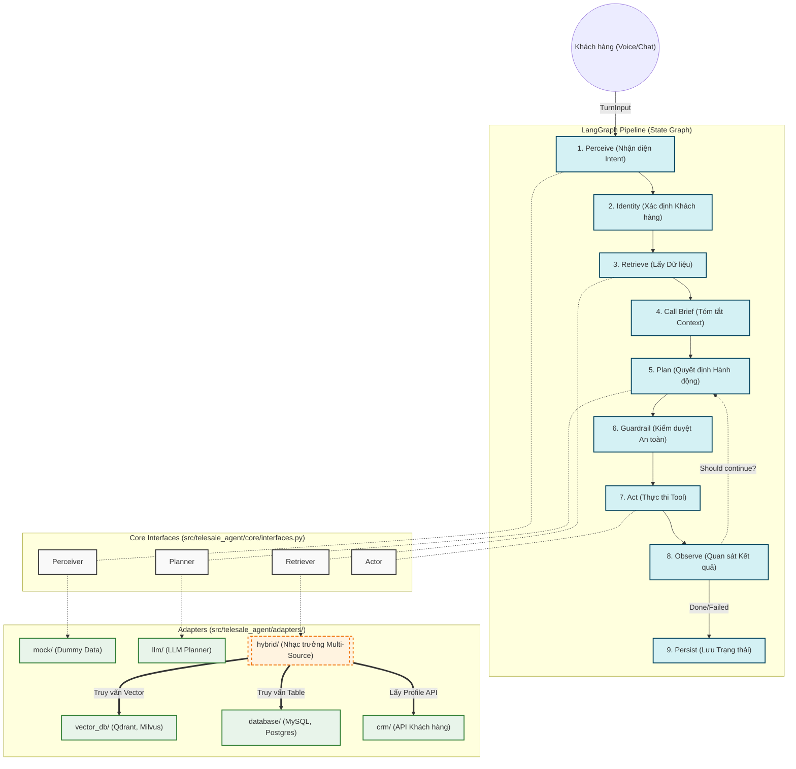

# Kiến trúc Hệ thống Telesale Agent

## Sơ đồ Kiến trúc & Luồng chạy

```mermaid
graph TD
    classDef core fill:#f9f9f9,stroke:#333,stroke-width:2px;
    classDef stepGraph fill:#d4f1f4,stroke:#05445e,stroke-width:2px;
    classDef adapter fill:#e8f4ea,stroke:#2e7d32,stroke-width:2px;
    classDef hybrid fill:#fff3e0,stroke:#ef6c00,stroke-width:2px,stroke-dasharray: 5 5;

    User(("Khách hàng (Voice/Chat)")) -->|TurnInput| Perceive

    subgraph LangGraph ["LangGraph Pipeline (State Graph)"]
        direction TB
        Perceive["1. Perceive (Nhận diện Intent)"]
        Identity["2. Identity (Xác định Khách hàng)"]
        Retrieve["3. Retrieve (Lấy Dữ liệu)"]
        CallBrief["4. Call Brief (Tóm tắt Context)"]
        Plan["5. Plan (Quyết định Hành động)"]
        Guardrail["6. Guardrail (Kiểm duyệt An toàn)"]
        Act["7. Act (Thực thi Tool)"]
        Observe["8. Observe (Quan sát Kết quả)"]
        Persist["9. Persist (Lưu Trạng thái)"]

        Perceive --> Identity
        Identity --> Retrieve
        Retrieve --> CallBrief
        CallBrief --> Plan
        Plan --> Guardrail
        Guardrail --> Act
        Act --> Observe
        
        Observe -.->|"Should continue?"| Plan
        Observe -->|"Done/Failed"| Persist
    end

    class Perceive,Identity,Retrieve,CallBrief,Plan,Guardrail,Act,Observe,Persist stepGraph;

    subgraph CoreInterfaces ["Core Interfaces (src/telesale_agent/core/interfaces.py)"]
        IPerceiver["Perceiver"]
        IRetriever["Retriever"]
        IPlanner["Planner"]
        IAct["Actor"]
    end
    class IPerceiver,IRetriever,IPlanner,IAct core;

    subgraph Adapters ["Adapters (src/telesale_agent/adapters/)"]
        AMock["mock/ (Dummy Data)"]
        AVector["vector_db/ (Qdrant, Milvus)"]
        ASQL["database/ (MySQL, Postgres)"]
        ACRM["crm/ (API Khách hàng)"]
        ALLM["llm/ (LLM Planner)"]
        
        AHybrid[["hybrid/ (Nhạc trưởng Multi-Source)"]]
    end
    class AMock,AVector,ASQL,ACRM,ALLM adapter;
    class AHybrid hybrid;

    Perceive -.- IPerceiver
    Retrieve -.- IRetriever
    Plan -.- IPlanner
    Act -.- IAct

    IPerceiver -.-> AMock
    IPlanner -.-> ALLM
    
    IRetriever -.-> AHybrid
    AHybrid ==>|"Truy vấn Vector"| AVector
    AHybrid ==>|"Truy vấn Table"| ASQL
    AHybrid ==>|"Lấy Profile API"| ACRM
```
